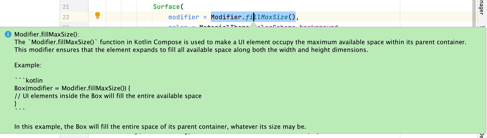
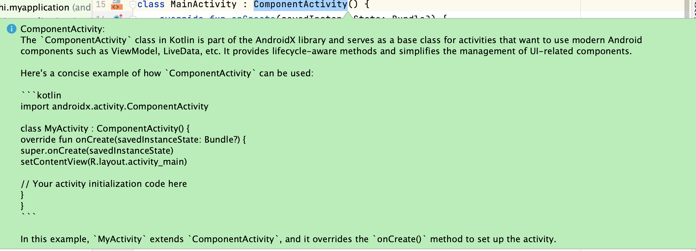
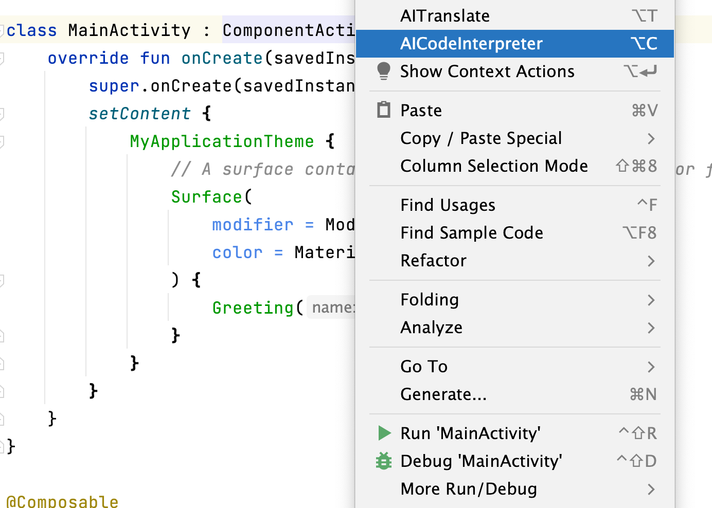

# AICodeInterpreter
This repository may contain the earliest implementation of free Java/Kotlin version of the GPT-3.5-Turbo API code.
Utilize the unlimited free GPT-3.5-Turbo API service provided by the login-free ChatGPT Web.

此存储库可能包含了最早实现的 Java/Kotlin 版本免费 GPT-3.5-Turbo API 的代码。
利用由无需登录的 ChatGPT Web 提供的无限免费的 GPT-3.5-Turbo API 服务。
<!-- Plugin description -->
## Description
AICodeInterpreter is an IntelliJ IDEA plugin that provides developers with convenient code interpretation functionality. The plugin defaults to supporting the free ChatGPT 3.5 API, allowing users to convert selected code snippets into natural language descriptions. Additionally, users can configure the plugin to use other generative language models such as Ollama, Google Gemini Pro, Moonshot, and DeepSeek as needed.

AICodeInterpreter是一款IntelliJ IDEA插件，为开发人员提供便捷的代码解释功能。该插件默认支持免费的ChatGPT 3.5 API，使用户能够将选中的代码片段转换为自然语言描述。同时，用户还可以根据需要自行配置使用Ollama、Google Gemini Pro、Kimi(Moonshot)、DeepSeek等生成式语言模型。

## Features
Key features include:

- Intelligent Code Interpretation: With a simple keyboard shortcut or right-click menu, users can request the plugin to interpret code into easily understandable natural language descriptions.
- Default Support for Free API: AICodeInterpreter seamlessly integrates with the free ChatGPT 3.5 API, enabling users to start using code interpretation functionality without additional payment or subscription.
- Configurable Language Models: Users can select and configure different generative language models according to their requirements, including Ollama, Google Gemini Pro, Moonshot, DeepSeek, etc., for diversified and specialized code interpretation.
- Multi-Language Support: The plugin supports code interpretation for various programming languages, including Java, Python, JavaScript, and others, catering to the needs of different developers.

关键特性包括:
- 智能代码解释： 选中代码片段后，通过简单的快捷键或右键菜单，用户可以请求插件将代码解释为易于理解的自然语言描述。
- 默认支持免费API： AICodeInterpreter默认支持免费的ChatGPT 3.5 API，用户可以直接开始使用代码解释功能，无需额外的付费或订阅。
- 可配置多种语言模型： 用户可以根据需求选择并配置使用不同的生成式语言模型，包括Ollama、Google Gemini Pro、Moonshot、DeepSeek等，以获取更多样化和专业化的代码解释效果。
- 多语言支持： 插件支持多种编程语言的代码解释，包括Java、Python、JavaScript等主流语言，满足不同开发人员的需求。

## Installation

- Install using the IDE's built-in plugin system:

  <kbd>Settings/Preferences</kbd> > <kbd>Plugins</kbd> > <kbd>Marketplace</kbd> > <kbd>Search for "AICodeInterpreter"</kbd> >
  <kbd>Install Plugin</kbd>

## Getting Started

<kbd>Choose Code/Text</kbd> > <kbd>Right Click / Alt(Option)+C</kbd> > <kbd>AICodeInterpreter</kbd> >

## 效果

<!-- Plugin description end -->
[Page on plugin repository site](https://plugins.jetbrains.com/plugin/24011-aicodeinterpreter)
