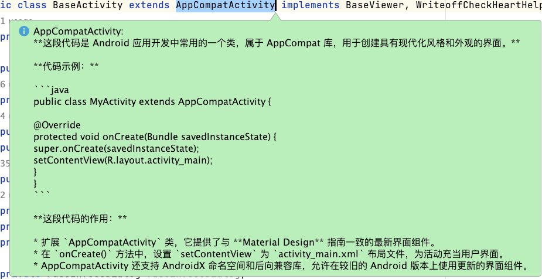
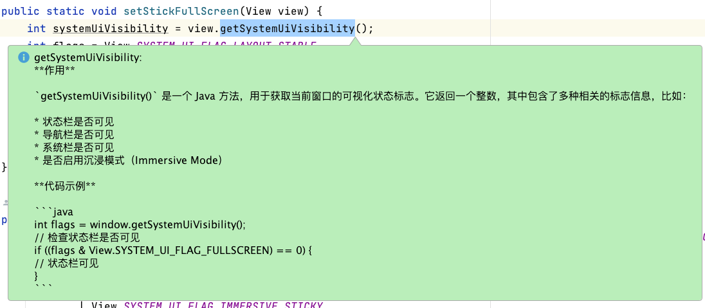
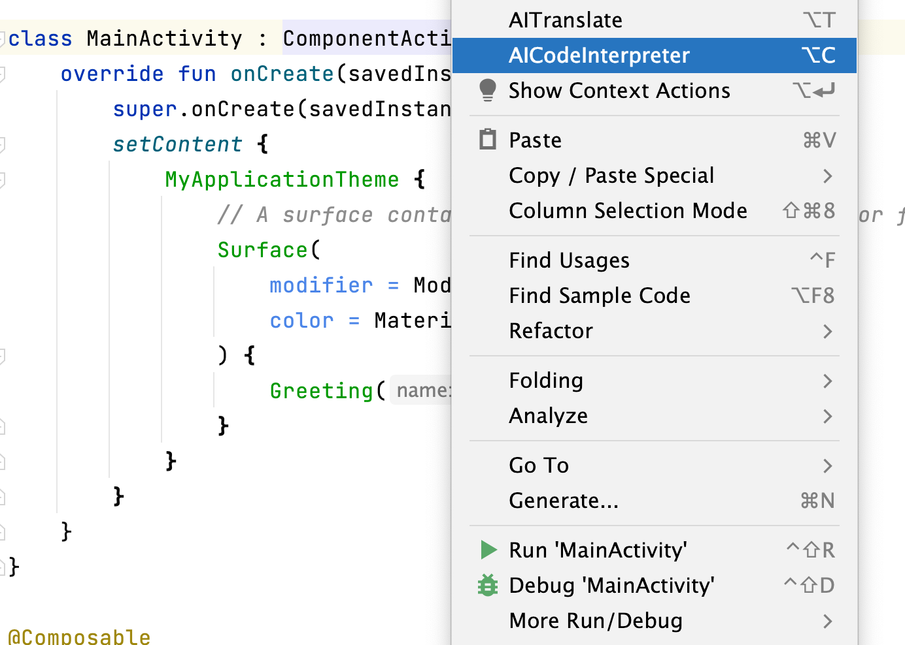

# AICodeInterpreter
<!-- Plugin description -->
## Description
The AICodeInterpreter, an IntelliJ plugin, seamlessly integrates Ollama and Google Gemini Pro. It interprets selected code snippets, generates comments, and polishes them, significantly enhancing code readability and comprehension.

这是一款基于IntelliJ的插件，名为AI代码解释器，旨在提高代码的可读性和理解性。该插件集成了Ollama本地大型模型和Google Gemini Pro大型模型，为用户提供强大的功能支持。
 
- AICodeInterpreter is available with JetBrains IDEs.
- Supported language: Java, Python, Go, C/C++, C#, JavaScript, TypeScript, PHP, Ruby, Rust, Scala and other programming languages.
- 兼容 Visual Studio Code、JetBrains IDEs 等主流 IDE；
- 支持 Java、Python、Go、C/C++、C#、JavaScript、TypeScript、PHP、Ruby、Rust、Scala 等主流编程语言。
## Features
Key features include:

Code Interpretation: Select a piece of code, and the plugin can interpret its usage, helping developers grasp functionality and intent more efficiently.
Supports over 40 programming languages, automatically recognizes programming languages and generates code explanations. Crossing the boundaries of programming languages and coding with more confidence.

代码解释：选中代码后，插件可以解释其使用方法，帮助开发者更快地理解代码的功能和意图。支持 40 多种语言的识别，选中代码后可自动识别编程语言并生成代码解释。跨越语言的边界，让你编码更自信。

## 效果

<!-- Plugin description end -->
[Page on plugin repository site](https://plugins.jetbrains.com/plugin/24011-aicodeinterpreter)
